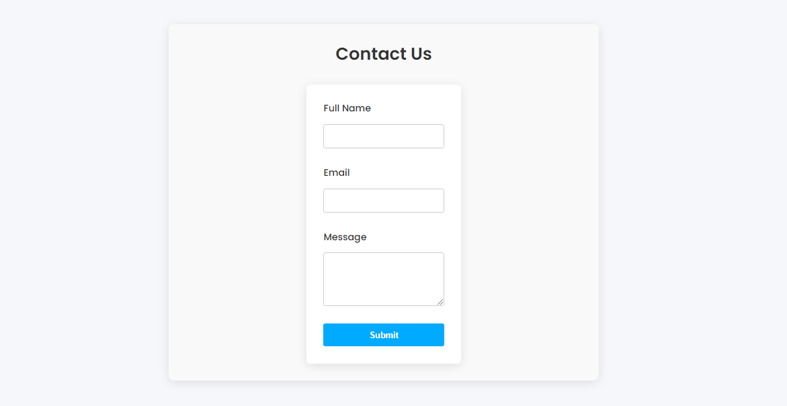
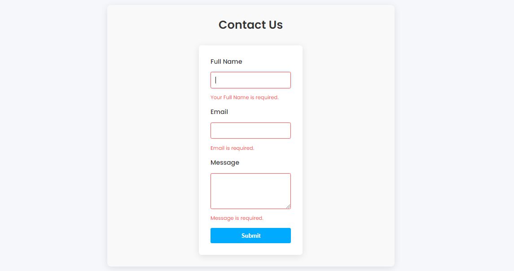
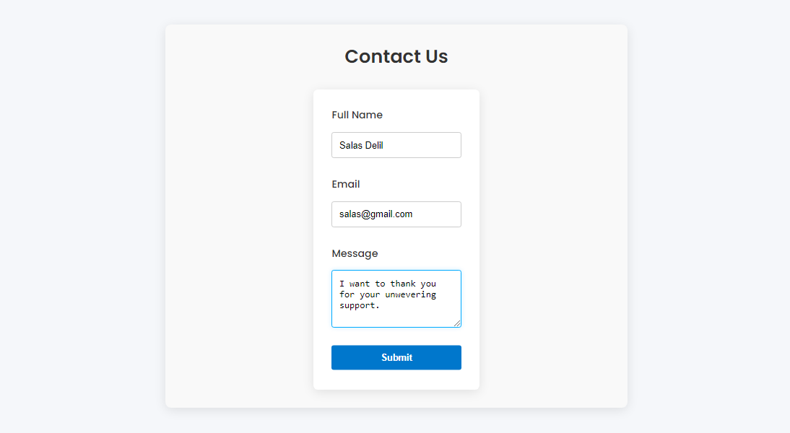

# Contact Form Application

This is a simple and elegant Contact Form application built with React, TypeScript, and Vite. The application features a form with full name, email, and message fields, along with validation, fancy UI elements, and animations.

## Features

- **Responsive Design**: The UI is fully responsive and works well on all screen sizes.
- **Form Validation**: Client-side validation is implemented using `react-hook-form` to ensure all fields are correctly filled out.
- **Smooth Animations**: The form elements feature smooth animations for an enhanced user experience.
- **Customizable**: Easily customizable CSS with modular stylesheets for each component.

## Technologies Used

- **React**: JavaScript library for building user interfaces.
- **TypeScript**: A superset of JavaScript that adds static types.
- **Vite**: A fast build tool that serves as an alternative to create-react-app.
- **CSS**: For styling the application, including animations and responsive design.

## Installation

To get started with the project, follow these steps:

1. **Clone the repository:**

    ```bash
    git clone https://github.com/SalasDelil/Contact-Form-Using-React-Hook-Form-task-5.git
    ```

2. **Navigate to the project directory:**

    ```bash
    cd Contact-Form-Using-React-Hook-Form-task-5
    ```

3. **Install the dependencies:**

    ```bash
    npm install
    ```

4. **Start the development server:**

    ```bash
    npm run dev
    ```

5. **Build the app for production:**

    ```bash
    npm run build
    ```

6. **Preview the production build:**

    ```bash
    npm run preview
    ```

## Usage

After starting the development server, open your browser and navigate to `http://localhost:5173`. You should see the contact form where users can enter their full name, email, and message.

Fill out the form and submit it to see the form data logged in the console.

## Screenshots

### 1. **Form Layout**



### 2. **Validation Error States**



### 3. **Submit Button Hover Animation**




## Contributing

If you'd like to contribute to this project, please follow these steps:

1. Fork the repository.
2. Create a new branch (`git checkout -b feature-branch`).
3. Make your changes and commit them (`git commit -m 'Add some feature'`).
4. Push to the branch (`git push origin feature-branch`).
5. Open a Pull Request.
